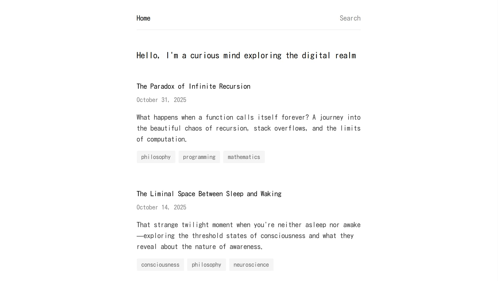
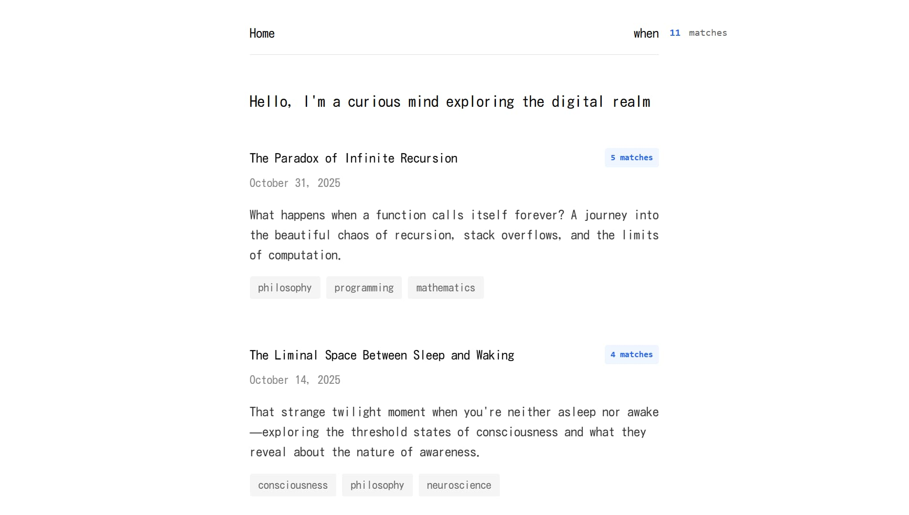

# blog

A static blog built with SvelteKit and Svelte 5. Posts are Markdown files with
Svelte components inside ([mdsvex](https://mdsvex.pngwn.io)). Every page is
prerendered, and a search box filters posts as you type and highlights the
matches.

<!-- prettier-ignore -->
| Home page | Search page |
| - | - |
|  |  |

```sh
bun install
cd apps/blog
bun run dev       # http://localhost:5173
bun run build     # prerender the site to build/
bun run preview   # serve build/ locally
```

## Write a post

Create `src/routes/blog/<slug>/+page.svx`. The folder name is the URL slug.
Start the file with front matter:

```md
---
title: "The Ship of Theseus and Your Body"
date: "2025-08-10"
tags: ["philosophy", "identity", "biology"]
excerpt: "If every atom in your body is replaced every seven years, ..."
published: true
---
```

[`src/routes/+page.server.ts`](src/routes/+page.server.ts) collects every post
at build time and sorts them by `date`, newest first. A post with
`published: false` is left out of the list.

## Search

[`src/lib/utils/search.ts`](src/lib/utils/search.ts) counts case-insensitive
matches of the query in each post's title, excerpt, tags and full text, and
ranks posts by that count.
[`src/lib/state/search.svelte.ts`](src/lib/state/search.svelte.ts) debounces
input by 300 ms and holds the results.
[`SearchHighlight.svelte`](src/lib/components/search/SearchHighlight.svelte)
wraps matches in `<mark>` on the post pages.

## Layout

```text
src/
├─ app.html              HTML template
├─ lib/
│  ├─ components/        blog, effects, layout and search components
│  ├─ state/             search state
│  ├─ types/             Post, SearchResult and related types
│  └─ utils/             search and highlight helpers, animation
└─ routes/
   ├─ +layout.server.ts  prerenders every page
   ├─ +layout.svelte     page shell
   ├─ +page.svelte       home page with the post list
   └─ blog/              layout and one folder per post
```
